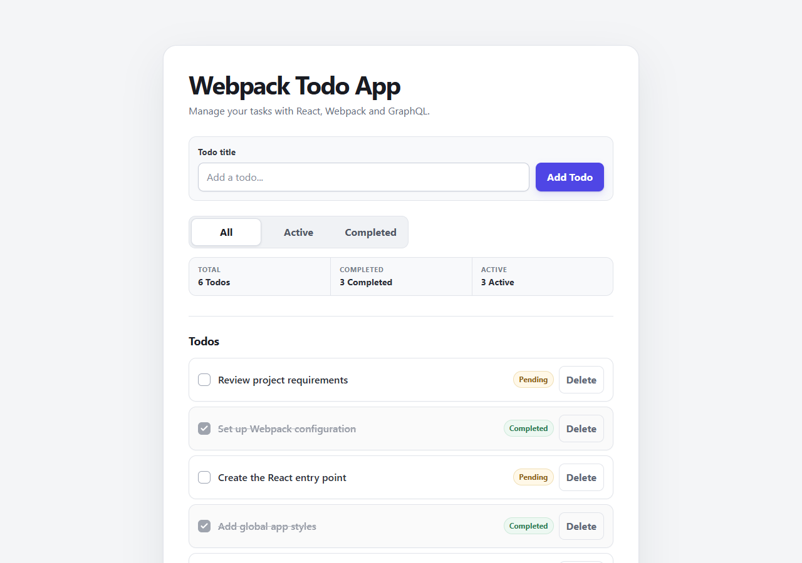
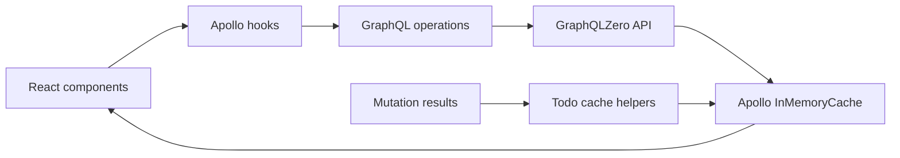
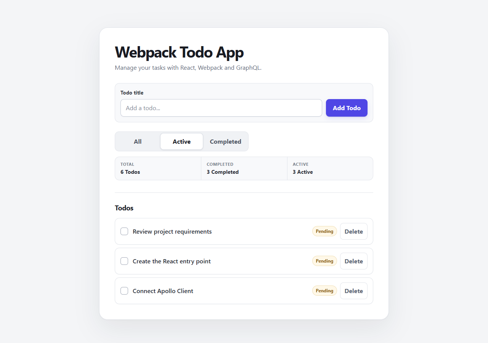
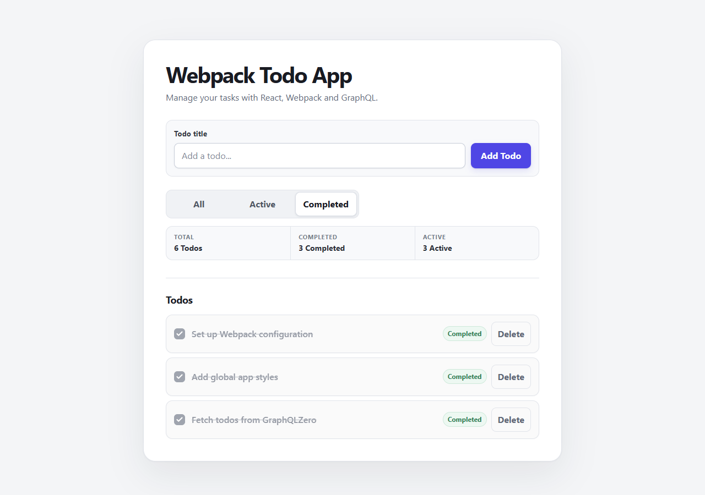
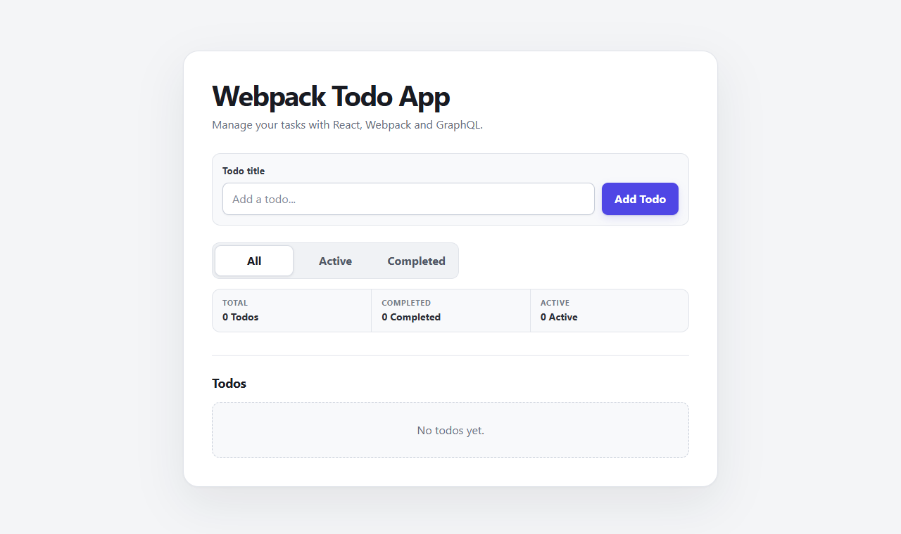
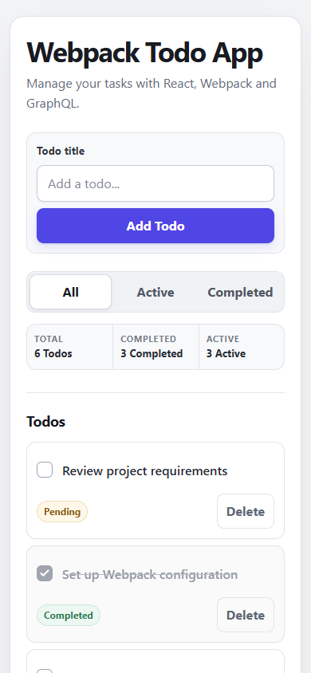

# Webpack Todo App

> A production-minded Todo application built with React, Apollo Client, GraphQL, and a fully manual Webpack toolchain.

[](https://react.dev/)
[](https://webpack.js.org/)
[](https://www.apollographql.com/docs/react/)
[](https://jestjs.io/)

## Overview

Webpack Todo App is a compact productivity application created without Create React App, Vite, or a framework abstraction. The project demonstrates how a modern React application can be assembled from first principles while still providing a polished interface, predictable GraphQL state, focused automated tests, and an optimized production bundle.

The application loads Todos from the [GraphQLZero](https://graphqlzero.almansi.me/) API and supports adding, completing, deleting, and filtering items. Apollo Client keeps the interface synchronized through explicit cache updates, so successful mutations do not require unnecessary refetches.



## Features

- Load Todos through a GraphQL query with safe loading, error, retry, and empty states
- Add, complete, reopen, and delete Todos
- Filter items by **All**, **Active**, and **Completed**
- Keep totals and filtered results synchronized with Apollo's normalized cache
- Responsive productivity-focused UI for desktop, tablet, and mobile
- Semantic controls, visible keyboard focus, accessible labels, and readable state indicators
- Hot Module Replacement during local development
- Lazy-loaded Todo list and production vendor/runtime splitting
- Content-hashed production assets and hidden production source maps
- Focused React Testing Library coverage with mocked GraphQL responses
- Optional bundle analysis that stays out of normal builds

## Tech Stack

| Area | Technology | Responsibility |
| --- | --- | --- |
| UI | React 19 | Component rendering and local filter state |
| Data | Apollo Client 4 | Queries, mutations, loading states, and cache synchronization |
| API | GraphQL / GraphQLZero | Todo data and mutation contract |
| Build | Webpack 5 | Bundling, code splitting, asset hashing, HMR, and optimization |
| Transpilation | Babel | Modern JavaScript and JSX transformation |
| Styling | CSS, CSS Loader, Style Loader | Responsive component and application styling |
| Testing | Jest, React Testing Library | User-focused UI and GraphQL behavior tests |
| Analysis | Webpack Bundle Analyzer | On-demand production bundle inspection |

## Why Webpack?

This project intentionally uses Webpack directly to make the build pipeline visible and configurable. Rather than inheriting hidden defaults from an application scaffold, the repository shows how each production concern is handled:

- Babel transpiles JavaScript and JSX with an explicit loader pipeline.
- CSS is processed through dedicated Webpack loaders.
- Webpack Dev Server provides HMR and history fallback during development.
- Dynamic `import()` creates a separate Todo list chunk.
- Production mode enables minification and tree-shaking.
- Deterministic module and chunk IDs improve long-term caching.
- Runtime and third-party dependencies are split into stable bundles.
- Bundle analysis is available through a separate command instead of slowing every build.

The result is a small project that doubles as a practical reference for understanding the moving parts behind a modern React build.

## Architecture

```text
src/
├── apollo/
│   ├── client.js          # Apollo Client and HTTP link configuration
│   └── todoCache.js       # Focused cache helpers for Todo mutations
├── components/
│   ├── TodoForm.jsx       # Add-Todo form and mutation feedback
│   ├── TodoItem.jsx       # Toggle/delete controls and mutation states
│   └── TodoList.jsx       # Render-only Todo collection
├── graphql/
│   ├── todoQueries.js     # GET_TODOS
│   └── todoMutations.js   # ADD, UPDATE, and DELETE operations
├── App.jsx                # Query state, filters, counts, and page states
├── App.test.jsx           # Critical behavior tests
├── index.jsx              # React and Apollo provider entry point
└── styles.css             # Application-wide visual system and responsive rules
```



`App` owns the query lifecycle, filter selection, derived counts, and page-level states. Mutations remain close to the controls that trigger them, while reusable cache helpers isolate the list-update rules. `TodoList` is loaded with `React.lazy`, preserving a clear feature-level split without introducing routing or unnecessary abstractions.

## GraphQL / Apollo

GraphQL operations are separated from UI components and named by intent:

- `GET_TODOS` loads the first page of Todo records.
- `ADD_TODO` creates a pending Todo.
- `UPDATE_TODO_COMPLETION` changes completion state.
- `DELETE_TODO` removes a Todo.

Apollo Client is configured once in `src/apollo/client.js` and provided at the application root. After a successful mutation, the helpers in `src/apollo/todoCache.js` update the cached `GET_TODOS` result directly:

- Added records are inserted without duplicating an existing ID.
- Updated records replace the matching cached item.
- Deleted records are removed from the cached list.

This keeps totals, filters, and visible rows consistent without refetching data that is already available from the mutation response.

> GraphQLZero is a fake API. Mutation responses are reflected in the Apollo cache for the current session, but changes are not permanently persisted by the remote service and can reset after a refresh.

## Production Optimization

The production configuration includes:

- Webpack production mode with JavaScript minification
- `contenthash` filenames for cacheable JavaScript assets
- Deterministic module and chunk IDs for stable rebuilds
- A dedicated runtime chunk
- A separate vendor bundle for third-party dependencies
- Lazy loading for the Todo list with a named async chunk
- Hidden source maps for production diagnostics without exposing source-map references in the UI
- Automatic output-directory cleanup before each build
- Babel loader caching for faster repeated compilations
- An optional static bundle report through `npm run analyze`

Build the optimized bundle with:

```bash
npm run build
```

Generate `dist/bundle-report.html` only when bundle inspection is needed:

```bash
npm run analyze
```

## Testing

The test suite uses Jest, React Testing Library, `jest-dom`, and Apollo's `MockedProvider`. Tests exercise observable user behavior rather than component implementation details or CSS.

Current coverage includes:

- Loading state
- GraphQL error and retry state
- Empty state
- Adding a Todo
- Toggling completion
- Deleting a Todo
- All / Active / Completed filters

Run the suite with:

```bash
npm test
```

All GraphQL responses are mocked during tests; the suite never depends on the live API.

## Screenshots

The screenshots below were captured from the running application with deterministic GraphQL fixture data so each documented state is reproducible.

### All Todos


### Active Filter



### Completed Filter



### Empty State



### Mobile

<p align="center">
  
</p>

## Installation

### Prerequisites

- A current Node.js LTS release
- npm

### Setup

1. Clone the repository and enter the project directory:

   ```bash
   git clone https://github.com/mohadesehesmaeilzadeh/webpack-todo.git
   cd webpack-todo
   ```

2. Install dependencies:

   ```bash
   npm install
   ```

3. Create `.env` from the included example and confirm the endpoint:

   ```env
   FAKEQL_ENDPOINT=https://graphqlzero.almansi.me/api
   ```

4. Start the development server:

   ```bash
   npm run dev
   ```

5. Open `http://localhost:3000` if the browser does not open automatically.

Available commands:

| Command | Purpose |
| --- | --- |
| `npm run dev` | Start Webpack Dev Server with HMR |
| `npm start` | Alias for the development server |
| `npm test` | Run the Jest test suite |
| `npm run build` | Create the optimized production bundle in `dist/` |
| `npm run analyze` | Build production assets and generate a bundle report |

## Challenges

### Keeping mutation results and filters synchronized

GraphQLZero accepts mutations but does not provide durable backend persistence. Explicit Apollo cache helpers were needed so add, toggle, and delete actions immediately update the list, counts, and current filter without redundant network requests.

### Building a toolchain without a scaffold

Configuring JSX transformation, CSS handling, environment injection, HMR, source maps, chunk naming, hashing, and production optimization manually required each build decision to be deliberate and verifiable.

### Testing asynchronous GraphQL states

Loading, failure, empty, and mutation flows all have different asynchronous transitions. Apollo's `MockedProvider` and accessible queries make these cases deterministic while keeping tests aligned with what users actually see and do.

### Balancing splitting and simplicity

The Todo list is lazy-loaded because it is the main non-critical feature boundary. Further splitting would add requests and configuration without meaningful value for an application of this size.

## What I Learned

- How to assemble a React application with Webpack and Babel without relying on a framework scaffold
- How Webpack's runtime, vendor splitting, deterministic IDs, and content hashes work together for browser caching
- How to organize GraphQL operations separately from presentation components
- How to update Apollo's cache predictably after mutations and avoid unnecessary refetching
- How to test GraphQL-driven React behavior with stable mocks and accessibility-first queries
- How loading, error, empty, disabled, and responsive states contribute to a production-ready UI
- How bundle analysis and source-map strategy fit into a practical production workflow
